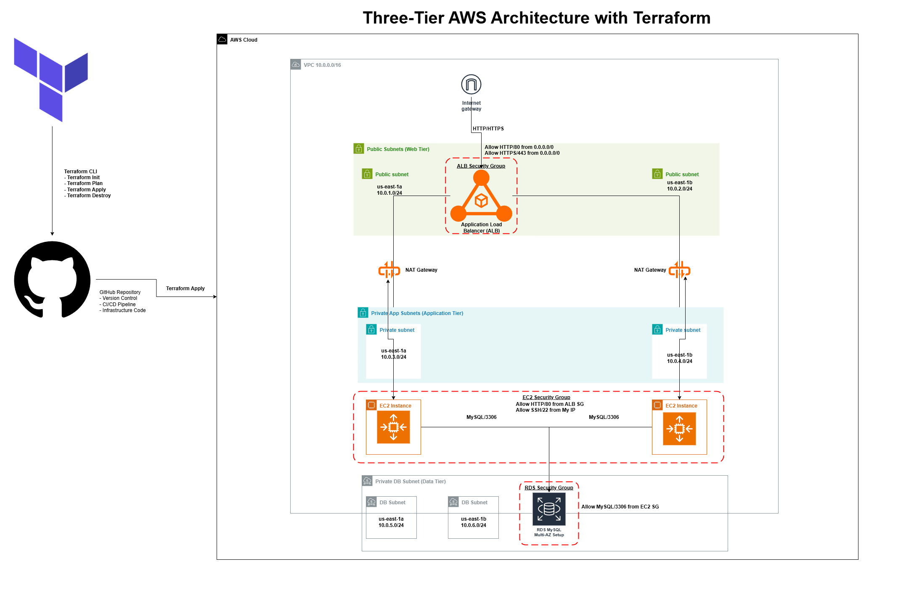

# Three-Tier AWS Infrastructure with Terraform



A production-ready, secure three-tier web application architecture on AWS built with Terraform.

## 🏗️ Architecture
[ Internet ]
|
[ Application Load Balancer (ALB) ] ← Public Subnet
|
[ Auto Scaling Group (EC2 Instances) ] ← Private App Subnet
|
[ RDS MySQL Database ] ← Private DB Subnet


## 📁 Project Structure
terraform-aws-three-tier-app/
├── modules/
│ ├── vpc/ # VPC, subnets, route tables
│ ├── ec2/ # Auto Scaling Group, Launch Template
│ └── rds/ # RDS instance, DB subnet group
├── main.tf # Root module configuration
├── variables.tf # Input variables
├── outputs.tf # Output values
├── providers.tf # Terraform providers
└── README.md


## 🚀 Features

- **High Availability**: Multi-AZ deployment across 2 availability zones
- **Security**: Least privilege security groups, private subnets
- **Scalability**: Auto Scaling Group with load balancer
- **Infrastructure as Code**: Complete Terraform configuration
- **Modular Design**: Reusable, maintainable code structure

## 🛠️ Technologies Used

- **Terraform** - Infrastructure as Code
- **AWS Services**:
  - VPC, Subnets, Route Tables
  - Application Load Balancer (ALB)
  - Auto Scaling Group (ASG)
  - RDS MySQL
  - Security Groups
  - IAM Roles

## 📋 Prerequisites

- AWS Account with CLI configured
- Terraform 1.0+
- Git

## ⚡ Quick Start

```bash
# Clone the repository
git clone https://github.com/YOUR_USERNAME/terraform-aws-three-tier-app.git
cd terraform-aws-three-tier-app

# Initialize Terraform
terraform init

# Plan the infrastructure
terraform plan

# Deploy (requires confirmation)
terraform apply
```
## 🔧 Configuration
Set your variables in terraform.tfvars:
- project_name = "my-three-tier-app"
- environment  = "dev"
- aws_region   = "us-east-1"

## 📊 Outputs
After deployment, you'll get:
- ALB DNS name for accessing the application
- RDS endpoint for database connections
- VPC and subnet information

## 🧹 Cleanup
- terraform destroy


